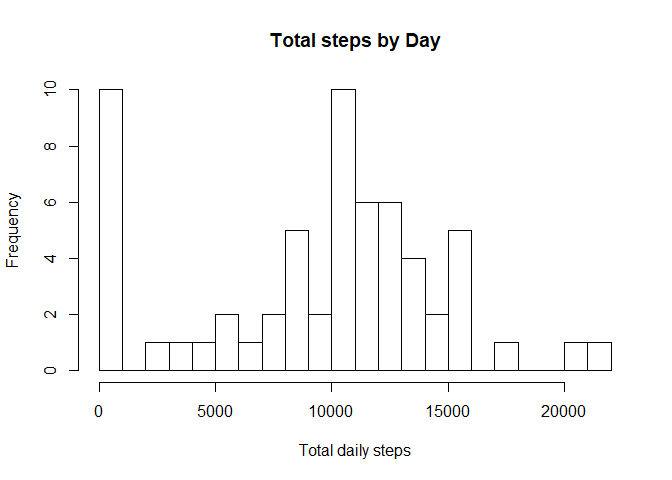
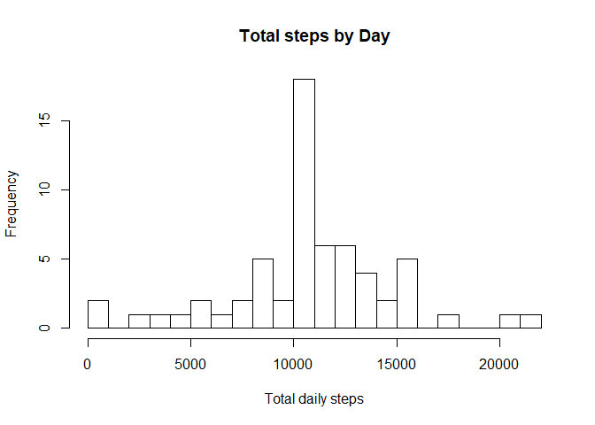
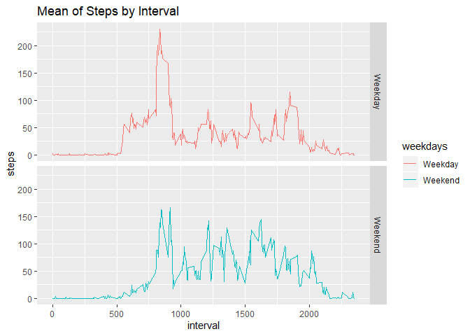

## Loading and preprocessing the data

Unzip file and read in data 


```r
unzip("activity.zip")
activity <- read.csv("activity.csv", header=TRUE)
summary(activity)
```

```
##      steps                date          interval     
##  Min.   :  0.00   2012-10-01:  288   Min.   :   0.0  
##  1st Qu.:  0.00   2012-10-02:  288   1st Qu.: 588.8  
##  Median :  0.00   2012-10-03:  288   Median :1177.5  
##  Mean   : 37.38   2012-10-04:  288   Mean   :1177.5  
##  3rd Qu.: 12.00   2012-10-05:  288   3rd Qu.:1766.2  
##  Max.   :806.00   2012-10-06:  288   Max.   :2355.0  
##  NA's   :2304     (Other)   :15840
```

## What is mean total number of steps taken per day?


```r
library(dplyr, quietly = TRUE)
```

```
## 
## Attaching package: 'dplyr'
```

```
## The following objects are masked from 'package:stats':
## 
##     filter, lag
```

```
## The following objects are masked from 'package:base':
## 
##     intersect, setdiff, setequal, union
```

```r
library(ggplot2, quietly = TRUE)
```

Total number of steps taken per day


```r
activity_date <- activity %>% group_by(date) %>% 
        summarise(total.steps = sum(steps, na.rm = TRUE))
hist(activity_date$total.steps, main = "Total steps by Day",
        xlab = "Total daily steps", breaks = 20)
```

<!-- -->

Mean total number of steps per day

```r
mean(activity_date$total.steps)
```

```
## [1] 9354.23
```

Median total number of steps per day

```r
median(activity_date$total.steps)
```

```
## [1] 10395
```

## What is the average daily activity pattern?


```r
activity_interval <- activity %>% group_by(interval) %>%
                summarise(mean.steps =mean(steps, na.rm = TRUE))
```


```r
library(ggplot2)
ggplot(activity_interval, aes(x=interval,y=mean.steps))+
        geom_line()+
        ggtitle("Average daily activity pattern")+
        ylab("steps")
```

<!-- -->

The 5-minute interval that, on average contains the maximum number of steps


```r
activity_interval %>% filter(mean.steps == max(mean.steps))
```

```
## # A tibble: 1 x 2
##   interval mean.steps
##      <int>      <dbl>
## 1      835       206.
```

## Imputing missing values

Total number of missing valuesin the dataset


```r
sum(is.na(activity))
```

```
## [1] 2304
```

I start by merging the complete activity data with the data grouped by interval. This enables us to see the mean steps even for specific interval periods with *NA* values


```r
activity.impute <- merge(activity, activity_interval)
```

I replace NA steps with the mean number of steps for the interval


```r
activity.impute$steps[is.na(activity.impute$steps)] <- activity.impute$mean.steps[is.na(activity.impute$steps)]
```

With the imputed data, I create a data set with the total number of steps by day


```r
activity.impute_date <- activity.impute %>% group_by(date) %>% 
        summarise(steps=sum(steps))
```

Summary plot and statistics


```r
hist(activity.impute_date$steps, main = "Total steps by Day",
        xlab = "Total daily steps", breaks = 20)
```

<!-- -->


```r
mean(activity.impute_date$steps)
```

```
## [1] 10766.19
```


```r
median(activity.impute_date$steps)
```

```
## [1] 10766.19
```


## Are there differences in activity patterns between weekdays and weekends?

The date variable is converted to date class and the days of the week are obtained and put in a new variable.


```r
activity.impute <- activity.impute %>% mutate(weekdays = weekdays(as.Date(date)))

activity.impute$weekdays <- ifelse(activity.impute$weekdays=="Saturday" | activity.impute$weekdays=="Sunday", "Weekend", "Weekday")

activity.impute$weekdays <- as.factor(activity.impute$weekdays)
```


```r
activity_weekday_int <- activity.impute %>% group_by(weekdays, interval) %>% 
        summarise(avg.steps = mean(steps))
        
ggplot(activity_weekday_int, aes(interval, avg.steps, color=weekdays)) +
        geom_line()+
        facet_grid(weekdays ~ .) +
  labs(title = "Mean of Steps by Interval", x = "interval", y = "steps")
```

<!-- -->

From the data, there is significant difference in the beginning and end of actiivties for weedays and weekends.
